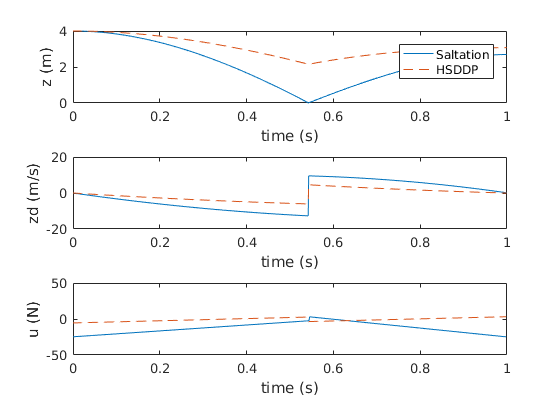
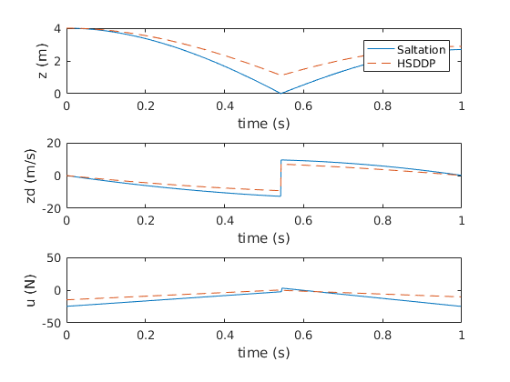
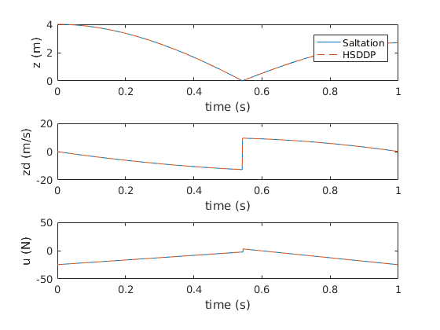
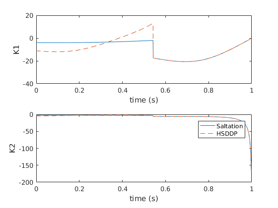
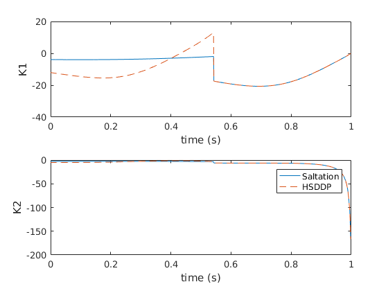
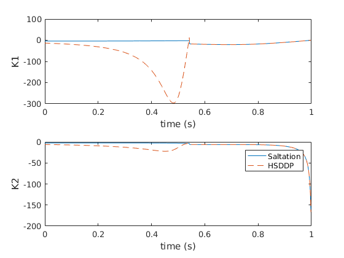
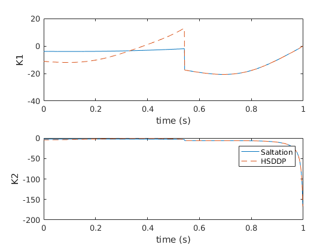
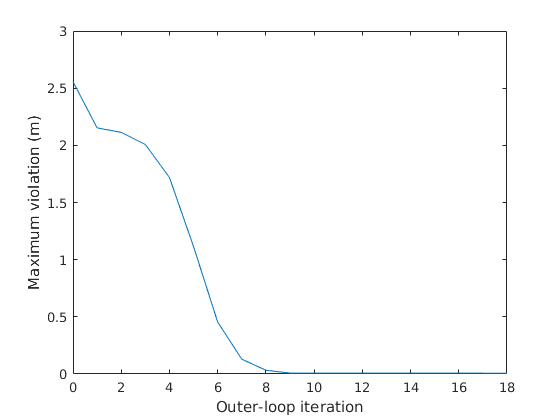

| state-control-iter1 | state-control-iter5 | state-control-iter18 |
| :---: | :---: | :---: |
||||

| feeback-iter1 | feebdack-iter5 | feedback-iter18 |
| :---: | :---: | :---: |
||||

| feedback-w-lagrange | violation-converge |
| :---: | :---:|
|  |  |